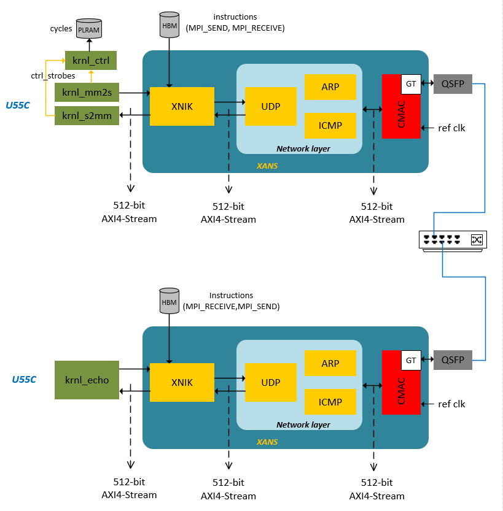

# Design summary

This design is used to benchmark the latency and throughput of the Xilinx Alveo Network Subsystem (XANS), which includes XNIK, UDP and CMAC. As shown in the figure below, two hardware bitstreams (.xclbin fiels) are created for this design. One hardware bitstream(.xclbin file) is used to generate the traffic, drive the traffic and count the cycles for different intervals. This implementation includes three user kernels, namely `krnl_mm2s`, `krnl_s2mm` and `krnl_ctrl`. Kernel `krnl_mm2s` generates and transmits data to XNIK. It also generates strobe signals when the first and the last data are transmitted to XNIK. Kernel `krnl_s2mm` reads the data received from XNIK and generates strobe signals when it receives the first data and the last data. The strobe signals generated by `krnl_mm2s` and `krnl_s2mm` are transmitted to `krnl_ctrl` to trigger following cycle counters. The value of the counters will be written into PLRAM and read out by host code for reporting the benchmarking results.

* latency cycle counter: the cycles between the first data being sent to XNIK and the first data received from XNIK. Subtracting this cycle number by the data transfer time gives us the RTT(Round Trip Time). For 100Gb Ethernet interface, the equations below gives the definitions of RTT and point-to-point latency of XNIK. Note, when the data size is getting much bigger, the latency might be longer than the reality, because the aggregated overhead of UDP+CMAC might cause longer data transfer time than the theoretical number used in the computation.

```sh
RTT = (latency_cycles * clock_period) - bytes_transferred / (100/8)

point-to-point latency = RTT/2
```
* total cycle counter: the cycles between the first data being sent to XNIK and the last data received from XNIK. This number is used to compute the throughput of XNIK. The equation below is used to compute the throughput of XANS. The equation below is used to compute the throughput of XNIK.

```sh
XNIK_throughput = data_bytes * 2 / (total_cycles * clock_period)
```

The other hardware bitstream (.xclbin file) is used to send the data received from XNIK back. It inclues a user kernel called `krnl_echo`. Note, all data transfer user kernels do not involve device memory access to avoid potential overhead caused by memory access latency/bottleneck. Also, the user kernels do not see the desination IP, which is controlled by XNIK via MPI instructions, and ultimately by the host code.



# Benchmark results

The following table summarizes the card-to-card benchmark results for the hardware bitstreams running at 300 MHz(clock_period = 1/3=3.33ns).

|Data size[bytes] | Latency[Cycles] | Total Time[Cycles] | RTT[us] | Point to Point Latency[us] | Throughput[GB/Sec] |
|-----------------|-----------------|--------------------|---------|----------------------------|--------------------|
|128              | 1235            | 1236               | 4.10231 | 2.05116                    | 0.0621981          |
|1024             | 1309            | 1328               | 4.27705 | 2.13853                    | 0.463114           |
|10240            | 1571            | 1822               | 4.41223 | 2.20612                    | 3.37549            |
|102400           | 3878            | 6439               | 4.72174 | 2.36087                    | 9.55141            |

# Steps for running c2c example on two alveo cards from two hosts. 

# clone the repository

git clone  https://github.com/Xilinx/HPC.git  --recursive

# build executable

1. change the config.txt to reflect your setup of the alveo cards and host machines. The
field of the config.txt are explained below:

hostname ip_address xclbin_file_with_absolute_path u55c_card_id

you can run 

xbutil scan

to find the alveo u55c card id


2. navigate to xans/examples/xnik_mem_c2c_benchmark

./run_compile.sh ./config.txt

# set up IP addresses and UDP sockets of 2 Alveo cards on two hosts 

../network_config/run_reset.sh config.txt

./run_netConfig.sh ./config.txt ./ip.txt

# run benchmark on two hosts, the size must be multiple of 64 bytes, and >= 128

- size.txt: list of size

- clock period: 3.33ns for freq=300MHz 

./run_bench.sh config.txt size.txt 3.33

or you could run each command in each machine separately

### on second host

./build_dir.hw.xilinx_u55c_gen3x16_xdma_base_2/hostname2/c2c_benchmark.exe ./hostname2_0_sockets.txt ./ip.txt 128 3.33

### on first host

./build_dir.hw.xilinx_u55c_gen3x16_xdma_base_2/hostname1/c2c_benchmark.exe ./hostname1_0_sockets.txt ./ip.txt 128 3.33

# build .xclbin

1. set up Vitis 2021.1_released environments

2. navigate to xans/hw/xnik/designs/xnik_mem_basic/xnik_mem_benchmark/driver

3. make cleanall PLATFORM_REPO_PATHS=/opt/xilinx/platforms DEVICE=xilinx_u55c_gen3x16_xdma_2_202110_1 TARGET=hw INTERFACE=0

4. make xclbin PLATFORM_REPO_PATHS=/opt/xilinx/platforms DEVICE=xilinx_u55c_gen3x16_xdma_2_202110_1 TARGET=hw INTERFACE=0

5. navigate to xans/hw/xnik/designs/xnik_mem_basic/xnik_mem_benchmark/xnik_echo

6. make cleanall PLATFORM_REPO_PATHS=/opt/xilinx/platforms DEVICE=xilinx_u55c_gen3x16_xdma_2_202110_1 TARGET=hw INTERFACE=0

7. make xclbin PLATFORM_REPO_PATHS=/opt/xilinx/platforms DEVICE=xilinx_u55c_gen3x16_xdma_2_202110_1 TARGET=hw INTERFACE=0
